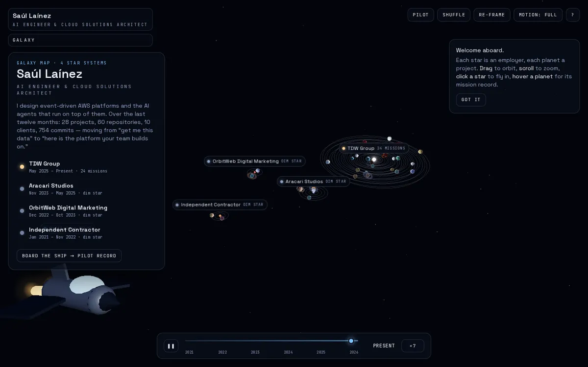
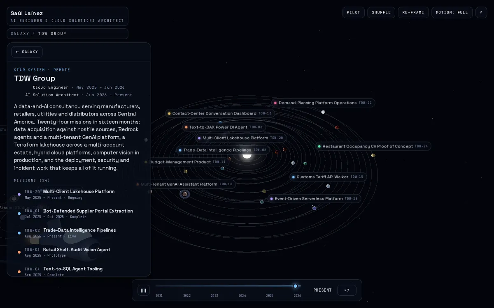
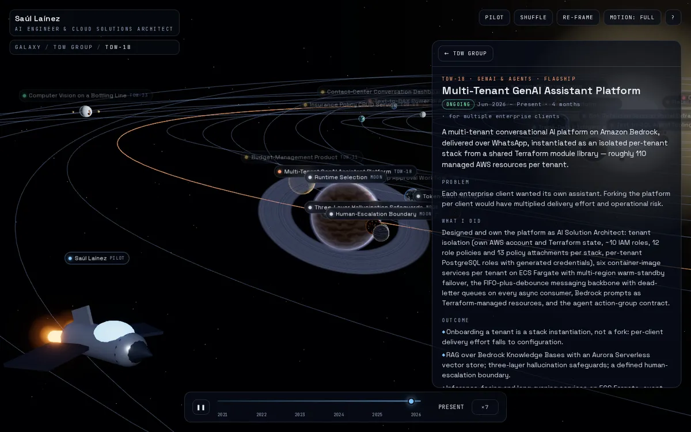
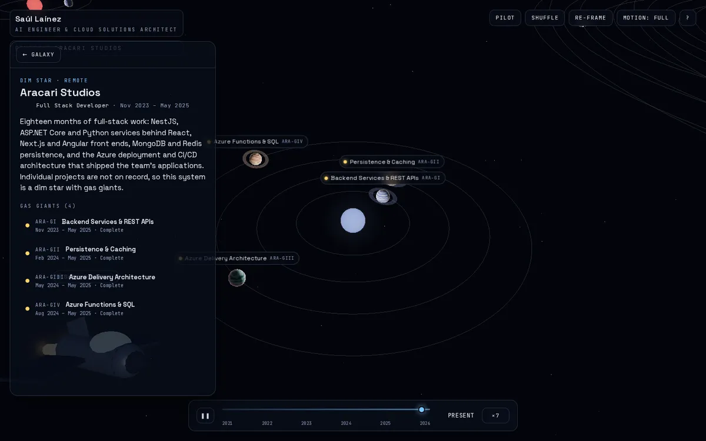
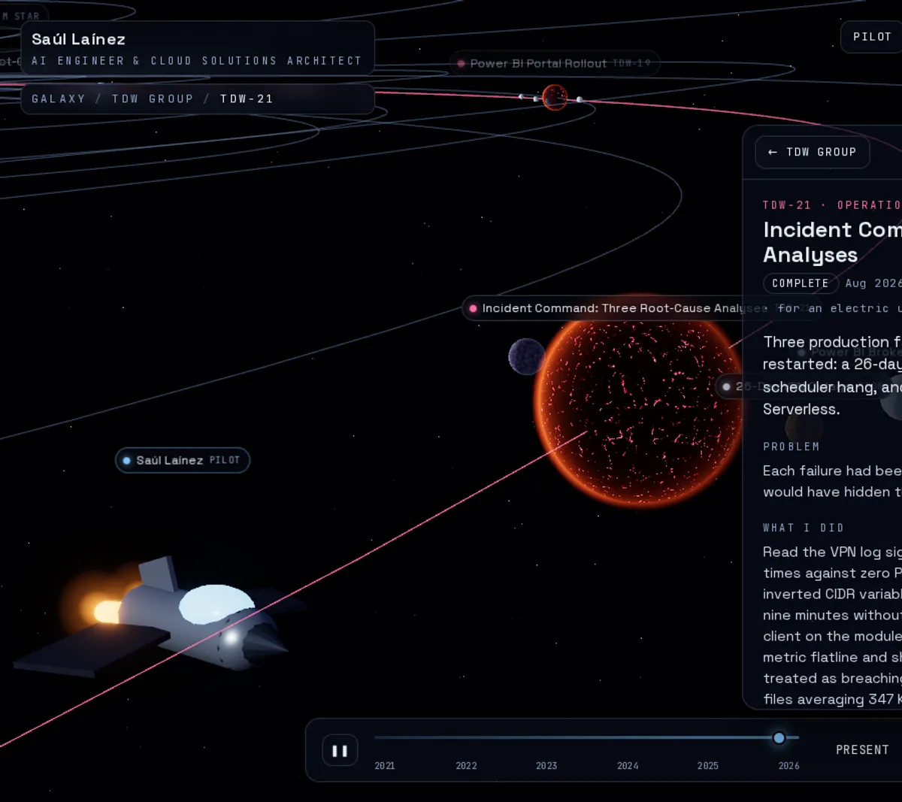
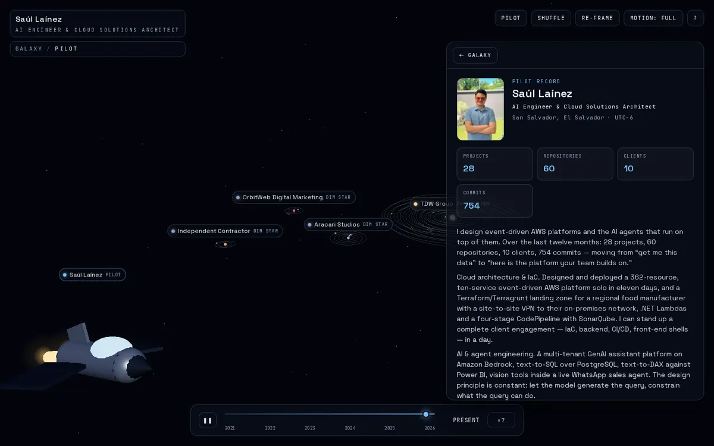

# Space Portfolio

A personal portfolio built as a space adventure: the visitor pilots a ship through a galaxy where **every employer is a star system** and **every project is a planet** with its own mission record. Employers without documented projects are **dim stars with gas giants** carrying partial records. Planet looks are procedurally generated and randomized per universe seed; orbits are chronological, so the mission clock at the bottom replays the career year by year.

Inspired by NASA's *Eyes on the Solar System*.

| Galaxy map | A star system (24 missions) |
|---|---|
|  |  |

| A planet with moons | A dim star with gas giants |
|---|---|
|  |  |

| Lava archetype | Pilot record |
|---|---|
|  |  |

Screenshots were rendered headless with SwiftShader (software WebGL); a GPU adds bloom and higher noise detail.

## Stack

- **Next.js 16** (App Router, Turbopack) · **React 19** · TypeScript
- **three.js** via **@react-three/fiber**, **@react-three/drei** (CameraControls, Stars, performance helpers) and **@react-three/postprocessing** (bloom + ACES)
- Custom GLSL: one shader program draws every planet archetype (rocky, terran, desert, ice, lava, gas, ringed), plus clouds, atmospheres, rings and stars. No textures or models on disk.
- **zustand** store, **motion** for panel transitions, **Tailwind CSS v4**
- **vitest** (content policy, orbit/prng/design math) and **Playwright** (smoke tests under SwiftShader)

## Run

```bash
npm ci
npm run dev        # http://localhost:3000
npm run build && npm run start
npm test           # unit tests
npm run test:e2e   # Playwright (starts the production server itself)
```

Useful URLs: `/` galaxy · `/system/tdw-group` a system · `/system/tdw-group/event-driven-platform` a mission record · `/pilot` the profile · `/missions` the full text index (also the no-WebGL fallback).

Query flags: `?seed=123456` shares a shuffled universe (looks change, positions never do); `?quality=low|medium|high` forces a render tier.

Controls: drag to orbit, scroll to zoom, click a star to fly in, hover/click a planet for its record. Keyboard: `← →` cycle planets, `Enter` open, `Esc` back, `Space` play/pause the clock, `[ ]` speed, `S` shuffle, `P` pilot, `R` re-frame, `?` help.

## Content

All copy lives in typed data under `content/`:

- `content/profile.ts` — the pilot (name, headline, summary, skills, certifications, links)
- `content/systems/*.ts` — the dim employers (each `bullets[]` entry becomes a gas giant)
- `content/systems/tdw-group/planets/*.ts` — one file per mission (planet); sub-projects are `moons[]`, dated events are `timeline[]`

Clients are anonymized by policy (`content/policy.ts`). `tests/unit/content-policy.test.ts` fails the build if a forbidden name, hostname, account id or IP appears in rendered content. Facts cite their sources in each planet's `sources` field, which is never rendered.

### Adding an image to a mission

1. Drop the file under `public/missions/<planet-slug>/`.
2. Reference it from a `timeline[]` entry: `image: { src, alt, caption, width, height }`.
3. Run `npm test` — the content test checks the file exists.

Diagrams in `assets-src/diagrams/*.mmd` are rendered with `npm run render:diagrams` (needs a Chromium; set `MMD_CHROME` if Playwright's is not installed).

## Deploy

**GitHub Pages** (static export). `.github/workflows/pages.yml` builds with `NEXT_OUTPUT=export` under the Pages base path, publishes `out/` and smoke-tests the live URL with Playwright. The social-preview image is the static `public/og.png` (static hosts serve generated image routes without a content type). One-time setup: Settings → Pages → Source: *GitHub Actions*, then set the repository variable `DEPLOY_PAGES=true` (the workflow is skipped until it is set). Pages on a private repository needs a paid plan; a public repository works on the free plan.

Reproduce the Pages shape locally:

```bash
NEXT_OUTPUT=export NEXT_PUBLIC_BASE_PATH=/space-portfolio \
NEXT_PUBLIC_SITE_URL=https://saul19-l98.github.io/space-portfolio npm run build
node scripts/serve-static.mjs out 3100 /space-portfolio
BASE_URL=http://127.0.0.1:3100/space-portfolio npx playwright test
```

**Vercel / Node hosting**: no flags needed; `npm run build && npm run start` serves the same app at the domain root.

## How it is built

- One persistent `<Canvas>` lives in the `(universe)` layout; routes only swap HTML panels. The URL is the single source of truth: `RouteSync` maps it to the store and performs navigation requested by the scene.
- `lib/orbit.ts` lays out orbits by project start date (seeded by slug only). `lib/planet-design.ts` derives each planet's archetype and palette from `hash(seed + slug)`.
- Labels are a single DOM layer positioned imperatively from the render loop (`LabelProjector` → `LabelLayer`), so they are accessible buttons and easy to test.
- Quality tiers (high / medium / low) adapt bloom, atmospheres and noise octaves; `navigator.webdriver` forces the low tier so headless tests stay fast.
